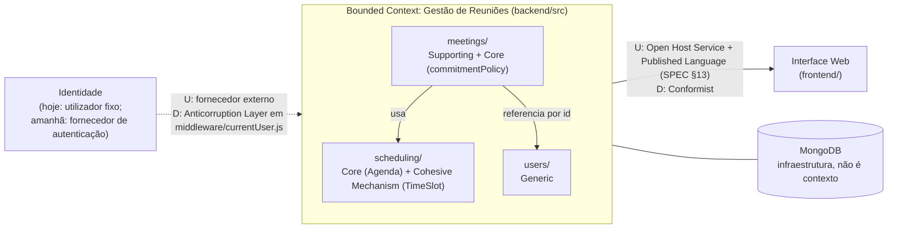

# Context Map

> O mapa dos contextos deste projeto e das relações entre eles (Evans, Parte IV, cap. 14).
> Decisão e porquê em `SPEC.md` §19.

## Resumo

Este repositório tem **um só Bounded Context**: *Gestão de Reuniões*, o backend. Lá dentro há
**um** modelo e **uma** linguagem (`GLOSSARY.md`). `users/`, `meetings/` e `scheduling/` são
**Módulos** desse contexto, não contextos separados: partilham a base de dados, referenciam-se
diretamente (`Meeting` guarda ids de `User`, e `.populate()` lê a coleção de utilizadores) e cada
termo tem um só significado em todos eles. Até à SPEC §19 a documentação chamava-lhes Bounded
Contexts. Essa classificação estava errada: Evans define um Bounded Context pela fronteira de
validade de um modelo, e aqui não há dois modelos.

As relações de Context Map que existem são com o que está **fora** do backend.

*(U = upstream, quem define o modelo; D = downstream, quem o consome.)*

## Relações

### Gestão de Reuniões → Interface Web: Open Host Service + Published Language / Conformist

- **Upstream (backend): Open Host Service.** Expõe um protocolo aberto (a API REST) igual para
  qualquer cliente, em vez de integrações à medida.
- **A língua desse protocolo é uma Published Language:** o contrato de cada endpoint está
  documentado em `SPEC.md` §13 (pedidos, respostas, erros, e os valores
  `pending`/`accepted`/`declined`).
- **Downstream (frontend): Conformist.** O frontend adota o modelo do backend tal como vem, sem
  camada de tradução: usa os mesmos estados de convite, mostra `hasConflict` e `myInviteStatus`
  sem os recalcular, e lê os erros pela mensagem que o backend envia (`shared/apiFetch.js`).
  Conformar-se é a escolha certa aqui: é a mesma equipa e a mesma linguagem, e uma tradução não
  protegeria o frontend de nada.
- **Porquê tratar o frontend como contexto à parte:** é um código e um deploy separados, ligados
  ao backend **só** pelo contrato HTTP. Mudar a forma de uma resposta parte o frontend, e é para
  isso que serve escrever a relação.

### Identidade → Gestão de Reuniões: Anticorruption Layer (hoje trivial)

- Hoje a identidade vem de um utilizador fixo, cujo id viaja no header `X-User-Id` (SPEC §2).
- Com autenticação real (OAuth, um fornecedor de identidade da empresa, etc.), o fornecedor seria
  um contexto upstream com o seu próprio modelo de "utilizador" (conta, credenciais, claims), que
  não é o `User` deste domínio (`name`, `username`).
- O ponto onde a tradução viveria já existe e é único: `middleware/currentUser.js`, que transforma
  o pedido num `User` do domínio através do `userRepository`. Nenhuma outra parte do backend lê o
  header. É aí que entraria a **Anticorruption Layer**, para o modelo do fornecedor não se
  espalhar pelo domínio.

### MongoDB: infraestrutura, não um contexto

O MongoDB não tem um modelo de domínio próprio, por isso não é um contexto no sentido de Evans. A
fronteira com ele é técnica: os repositórios e os ficheiros `*Model.js` (SPEC §15).

## Dentro do contexto: dependências entre Módulos

Não são relações de Context Map, porque é tudo o mesmo modelo, mas ficam registadas:

| De | Para | Como |
|---|---|---|
| `meetings/` | `scheduling/` | Constrói `TimeSlot`s e `Agenda`s, e pergunta à agenda se há conflito. `scheduling/` não conhece reuniões. |
| `meetings/` | `users/` | Guarda ids de `User`. `meetingRepository.findByIdWithDetails()` usa `.populate()` para ler `name`/`username` (a costura documentada em `DOMAIN_MIGRATION.md`). |
| `middleware/` | `users/` | `currentUser.js` usa `userRepository` para validar o utilizador do pedido. |

**Quando é que isto passaria a ser mais do que um contexto:** se `users/` crescesse para um sistema
de contas com regras próprias (perfis, permissões, equipas), com outra equipa e outro significado
de "utilizador", então sim, seriam dois modelos. O `.populate()` passaria a ser uma tradução
explícita (um read model ou uma Anticorruption Layer), e esta tabela passaria a ser uma relação de
Context Map.
